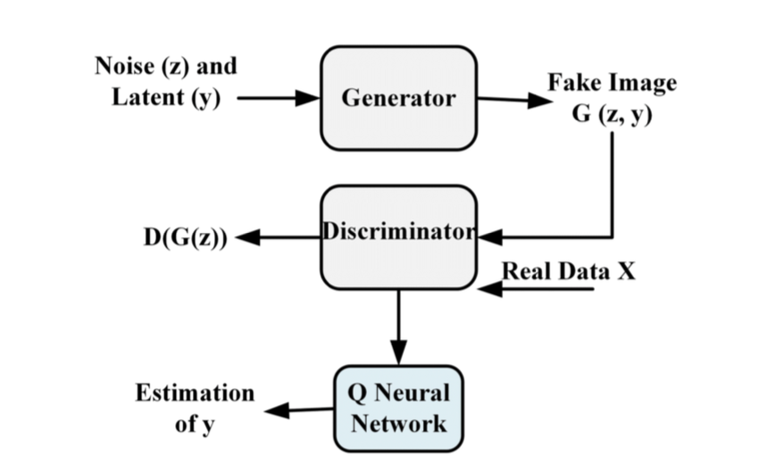
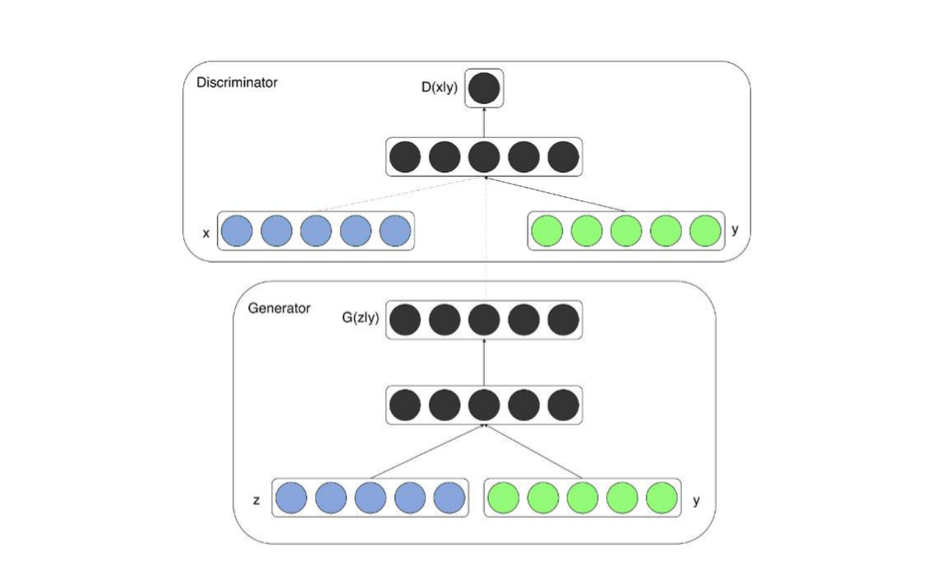
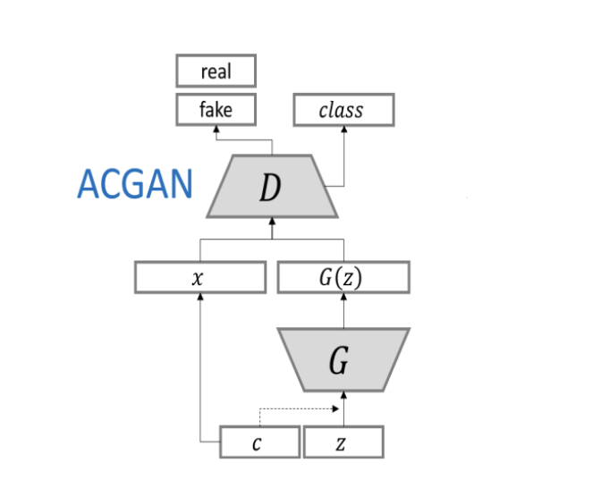
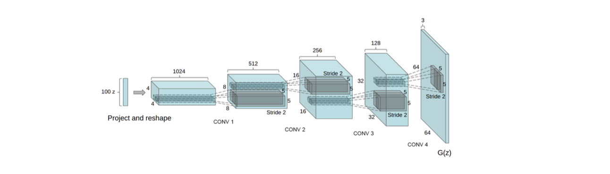

# Deep Learning Based Clothing Generation Using GAN Variants (CGAN, ACGAN, InfoGAN, DCGAN, and SN-GAN)

## Context

Fashion is one of the most dynamic industries, consisting of a multi-variable ecosystem that promotes self-expression and cultural representation to its users, costanly navigating a complex global
market.This changing flux has pushed retailers to aim for low cost and flexible design productions with a speed implementation, where key strategies applied in the development of a line or a product have the potential to increase a brand profitability position. Heritage plays a crucial role in a brand’s identity, as it has the power to affect several generations and, consequently, profitability. The implementation of patterns
on products goes back decades, as is the case with the famous Louis Vuitton monogram created in 1903. When it comes to embracing this heritage, developing new designs in line with current market trends can be a challenge, considering not only the time spent developing a product and production costs,but also the growing need to use sustainable techniques. Consolidating designs through a structured chain that incorporates a sustainable pattern
requires a complex dominant process to reduce resource use and waste in circular economies.

Artificial Intelligence has the potential to help designs generate images of similar-looking garments for the development of fashion lines, resulting in an efficient mitigation
of overproduction.Current literature focuses largely on improving image generation capabilities, with much of the literature focusing on color datasets. The intent of this project is to develop high-quality image generation that focuses on form and structure—rather than color or texture that aligns with the early stages of fashion design, where the primary concern is creating shapes for garments.

[Goodfellow et al. 2014] proposes the baseline Generative Adversarial Nets (GANs) folowing a minimax two-player gamer prerrogative, with a Discriminator(D) and a Generator(G) as a framework, showing a positive quantitative evaluation of the generated samples.The conditional version of GAN named CGAN introduces conditioning, which the generation of results is controlled by a condition that facilitates obtaining a specific result[Mirza and Osindero 2014]. With the same approach,[Odena et al. 2017] with ACGAN incorporates label conditioning, in which the discriminator acts as a classifier predicting the class of the generated images, resulting in the generation of more realistic images.

Another variation of GAN’s relies in DCGAN, elucidated by [Radford et al. 2016] stabilizes the GAN training and improve image generation incorporing deep convolutional neural networks.[Miyato et al. 2018a] developed SN-GAN applying spectal normalization to stabilize the training of the discriminator in and preventing from becoming too powerful.The focus of this project is to investigate effective model implementations that can be leveraged
by the fashion industry to generate high-quality vestment designs. Using the Fashion MNIST dataset, is proposed a benchmarking study of various models and architectures, with emphasis on baseline generative models such as CGAN, DCGAN, as well as their subsequent evolutions, following the stipulations of the original articles and from the book Generative Adversarial Networks with Python [Brownlee 2019].

## Architectures

### InfoGAN
The Information Maximizing GAN, or InfoGAN proposes control variables that are automatically learned by the architecture and allow control over the generated image, such as style and thickness.

  

### CGAN
To address the limitations of GANs in generating random images from a specific domain, CGAN conditions both the Generator and the Discriminator on a class label. 

  

### A-CGAN
A-CGAN is a type of conditional GAN that proposes an auxiliary classifier, based on a CGAN extension, with the goal of modifying the Discriminator to predict whether an image is real or fake, as previously established, and also the class label of the image. 

  

### DCGAN
In the proposed DCGAN architecture, the generator and discriminator are built using deep convolutional networks, replacing traditional poolying layers with fractional-strided-convolutions in the generator and strided convolutions in the discriminator 

  

### SN-GAN

With the desire to stabilize the training of the discriminator Spectal Normalization shows the
property that Lipschitz constant is the only hyper-parameter to be tuned.For this work was created a hybrid approach called SN-DCGAN, where the weights of the Discriminator were normalized via Spectral Normalization.

